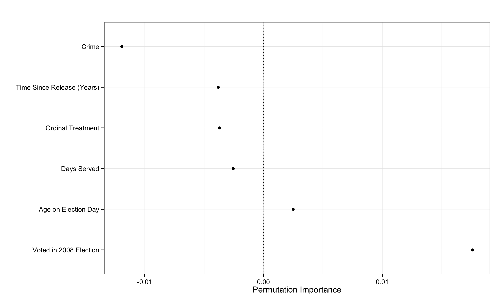

# Summary

This package contains functions useful for exploratory data analysis using random forests, which can be fit using the [randomForest](https://cran.r-project.org/package=randomForest), [randomForestSRC](https://cran.r-project.org/package=randomForestSRC), or [party](https://cran.r-project.org/package=party) packages. These functions can compute the partial dependence of covariates (individually or in combination) on the fitted forests' predictions, the permutation importance of covariates, as well as the distance between data points according to the fitted model.

Partial dependence, as described by @friedman2001greedy, estimates the marginal relationship between a subset of the covariates and the model's predictions by averaging over the marginal distribution of the compliment of this subset of the covariates. This approximation allows the display of the relationship between this subset of the covariates and the model's predictions even when there are many covariates which may interact. This functionality works with models fit by any of the aforementioned packages to any of the supported types of outcome variables. `partial_dependence` can be parallelized and also contains a number of additional parameters which allow the user to control this approximation. There is an associated plot function `plot_pd` which constructs plots for a wide variety of possible outputs from `partial_dependence` (e.g., when pairs of covariates are considered jointly, when each covariate is considered separately, when the outcome variable is categorical, etc).

Permutation importance estimates the importance of a covariate by randomly shuffling its values, breaking any dependence between said covariate and the outcome, and then computing the difference between the predictions made by the model with that covariate shuffled and the predictions made when the covariate was not shuffled. If the covariate was useful in generating predictions then the prediction errors will increase in expectation when the covariate is shuffled, whereas no such increase can be expected when the covariate has no influence. Although all three of the random forest packages provide at least one method of assessing variable importance, `variable_importance` provides a consistent way to compute permutation importance across all packages. `variable_importance` can also compute local importance. Rather than computing the average difference in prediction errors between the permuted and unpermuted data across all the training data (giving one number for each covariate), local importance computes the average change in the prediction error for each observation. This can be examined directly, or, in the case of a categorical outcome variable, can be aggregated to each class level. In the case of a continuous outcome variable the change in the prediction errors can be smoothed at different values of the outcome variable, giving a similar display. Lastly, `variable_importance` can operate on multiple variables simultaneously, giving the joint permutation importance of a set of covariates. This can be used to detect interactions by comparing the permutation importance of, for example, two covariates, by computing their joint permutation importance and comparing that to the sum of their individual permutation importance estimates. `plot_imp` provides a visualizations for all possible outputs.

Due to the tree-structure of a random forest, there is a natural way to define a distance between data points: the proportion of times that the data points were in the same terminal node. This is called "proximity" and can be used do model-based clustering when the random forest was unsupervised, and can be used to visualize the model in the supervised case. Making generic the compuation of the proxmity matrix would require a consistent API for accessing information in the individual trees in the random forest, which does not exist, however, `extract_proximity` can extract a proximity matrix computed by one of the supported packages. These matrices are too high dimensional to be visualized directly, so `plot_prox` supports the visualization of two of the principal components of this matrix, as estimated by `prcomp` (included in the base distribution of `R`). `plot_prox` provides arguments which additionally allow the user to change the color, shape, and size of points according to auxillary information, such as the observed class label for categorical outcomes, or a covariates, which may aid the aforementioned visualization tasks.

# References
